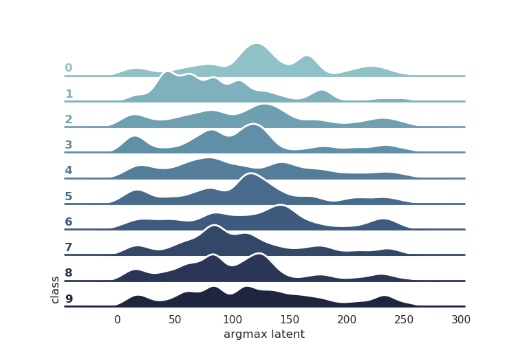
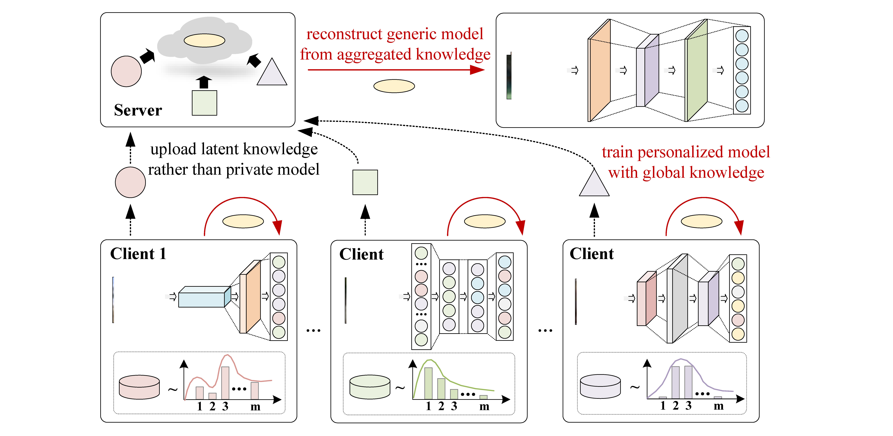
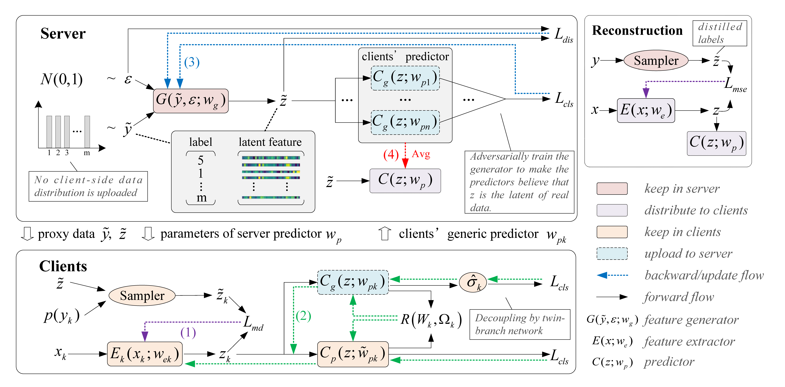
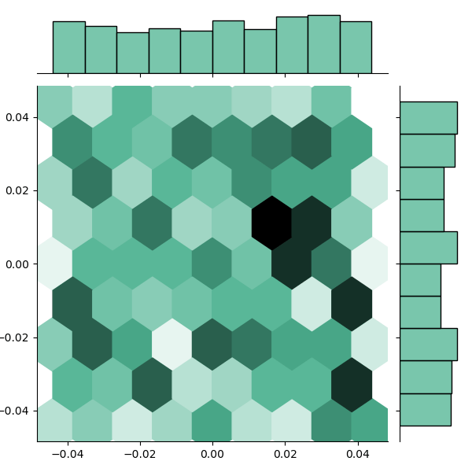

# FedTED

Source code of "Improving Generalization and Personalization in Model-Heterogeneous Federated Learning"




<!-- TODO: add paper link and author link after pub -->

## Declaration

This paper is currently under blind review, and we have ensured that **all contents** in the project **that may reveal the authors' information are removed**.

## 1. Requirements

A suitable [conda](https://conda.io/) environment named `FedTED` can be created
and activated with:

```bash
$ conda create -n FedTED python=3
$ conda activate FedTED
$ conda install pytorch torchvision -c pytorch
$ pip3 install -r requirements.txt
```

## 2. Getting Started

After completing the configuration, you can run as follows.

```bash
$ python main.py --algorithm <alg_name> --exp_conf <exp_conf.yaml> --data_conf <data_conf.yaml> --model_conf <model_conf.yaml> --seed <seed> --device <seed>
```

For example, run FedTED on MNIST with model-heterogeneous settings:

```bash
$ python main.py --algorithm FedTED --exp_conf ./configs/template/exp/het-exp.yaml --data_conf ./configs/template/data/mnist.yaml --model_conf ./configs/template/model/het-mnist.yaml --seed 15698 --device cuda:0
```

## 3. Usage

### 3.1 Arguments

In this project, main.py takes the following arguments:

+ `--algorithm`: name of the implemented algorithms.
+ `--num_clients`: number clients, if not specific, use the value in `data_conf.yaml`
+ `--exp_name`: exp name, sub dir for save log, if not specific, use the value in `exp_conf.yaml`
+ `--exp_conf`: experiment config yaml files
+ `--data_conf`: dataset config yaml files
+ `--public_conf`: public dataset config yaml files, default is None. For FedMD and Kt-pFL. 
+ `--model_conf`: model config yaml files
+ `--device`:  run device (cpu | cuda:x, x:int > 0)
+ `--seed`: random seed
+ `--save_model`: bool, if save model at each test interval.

### 3.2 EXP Config YAML

This is a typic yaml file:

```yaml
# All algorithm in the same experiment use same confing file
# 1. Settings
exp_name: "het-template" # name of experiment
heterogeneous: True
# 2. Basic args for FedAvg
rounds: 100 # communication rounds
epochs: 10 # epochs of local update
loss: 'CrossEntropyLoss' # loss fn name in torch.nn.*
opt: 'Adam'  # optimizer name in torch.optim.*, e.g. Adam, SGD
optim_kwargs: # args for optimizer
  lr: 1e-3 # learning rate of local update
batch_size: 32 # batch_size of local update
sample_frac: 0.5 # select fraction of clients
test_interval: 1
# 3. Optional args for FL algorithms
# ----3.1 Args for Center
center_update_samples: # if not None, means the used samples in each update epoch, recommend as None
# ---- 3.2 Args for FedMD and Kt_pFL
pretrain_epochs: 1   # pretrain epochs in public dataset
num_alignment: 200   # number of alignment data in FedMD/Kt_pFL
distill_lr: 1e-4  # lr for distillation
distill_epochs: 1 # epochs for distillation
distill_temperature: 20 # temperature for distillation
# ---- 3.3 Args for FedDF
#       note: public_data and distill_temperature is same as 3.2
ensemble_epoch: 5
ensemble_lr: 1e-4 # lr for ensemble, suggest lower than lr
# ---- 3.4 Args for FedDistill
fed_distill_gamma: 1e-4 #1e-4 # According to our test, it's value should not be larger than 1e-4
early_exit: 5  # exit the algorithm (FedDistill), and use norm FedAvg.
fed_distill_aggregate: True # if aggregate model weights by avg. If False, vanilla FedDistill (weak but save communication resource), else, FedDistill + FedAvg.
# ---- 3.5 Args for FedGen
#       note: distill_temperature s same as 3.2
generative_alpha: 10.0  # hyper-parameters for clients' local update
generative_beta: 1.0  # hyper-parameters for clients' local update
gen_epochs: 10  # epochs for updating generator
gen_lr: 1e-4  # lr for updating generator
# ---- 3.6 Args for FedFTG,
#       note: gen_epochs, gen_lr is same as 3.5
#             ensemble_epoch, ensemble_lr is same as 3.3
#             distill_temperature is same as 3.2
finetune_epochs: 1
lambda_cls: 1. # hyper-parameters of updating generator
lambda_dis: 1. # hyper-parameters of updating generator
```

### 3.3 Run FL algorithms by our codes

Specify the arguments of `--algorithm` to run the deployed benchmark algorithm. In addition to FedTED, the following 12 algorithms are  supported at present:

+ 3 most base benchmark: `Local`,`Center`, [FedAvg](https://arxiv.org/abs/1602.05629)
+ 2 SOTA Data-Heterogeneous, Model-Homogeneous Benchmark: [FedProx](https://github.com/litian96/FedProx), [SCAFFOLD](https://github.com/ongzh/ScaffoldFL)
+ 1 Distill-based SOTA Data-Heterogeneous, Model-Homogeneous Benchmark: [FedDF](https://arxiv.org/pdf/2006.07242)
+ 1 SOTA generic, personalized balance Benchmark (Model-Homogeneous):[FedRoD](http://arxiv.org/abs/2107.00778)
+ 2 SOTA data-free distillation Benchmark (Model-Homogeneous):  [FedFTG](https://arxiv.org/pdf/2203.09249v1.pdf), [FedGen](http://arxiv.org/abs/2105.10056)
+ 3 SOTA Model-Heterogeneous Benchmark: [FedMD](http://arxiv.org/abs/1910.03581), [Kt-pFL](http://arxiv.org/abs/2111.02862), [FedDistill](http://arxiv.org/abs/1811.11479)

### 3.4 Supported Federated Datasets

#### Four types of federated data production are supported

1. Subset of entire Leaf：[Leaf](https://arxiv.org/abs/1812.01097)
2. dirichlet split：[FedProx](https://arxiv.org/abs/1812.06127)
3. create by shard：[FedAvg](https://arxiv.org/abs/1602.05629)
4. synthetic：[FedProx](https://arxiv.org/abs/1812.06127)

#### Partition methods for each dataset

|   Dataset    | leaf | dirichlet | shard |
| :----------: | :--: | :-------: | :---: |
|    MNIST     |      |     Y     |   Y   |
| FashionMNIST |      |     Y     |   Y   |
|    EMNIST    |      |     Y     |   Y   |
|   CIFAR10    |      |     Y     |   Y   |
|   CIFAR100   |      |     Y     |   Y   |
|   femnist    |  Y   |           |       |
|    celeba    |  Y   |           |       |
|    reddit    |  Y   |           |       |
|   sent140    |  Y   |           |       |
|  shakespare  |  Y   |           |       |
|  synthetic   |  -   |     -     |   -   |

### 3.5 Supported Client Models

+ Logistic regression

+ MLP
+ Tested CNN by [FedAvg](https://arxiv.org/abs/1602.05629) and  [FedMD](http://arxiv.org/abs/1910.03581)
+ LetNet
+ AlexNet
+ ResNet
+ MobileNet_v2
+ ShuffleNet_v2
+ SqueezeNet
+ LSTM
+ GRU
+ RNN
+ Transformer
+ ViT
+ Mnist_LSTM
+ Mnist_GRU
+ Mnist_RNN
+ Twin-Branch
+ Generator


## 4. Introduction to FedTED 

FedTED is a model-heterogeneous generalization-personalization balanced framework via **t**win-branch network and f**e**ature **d**istillation.

### 4.1 Scenario

In model-homogeneous federated learning, expensive communication overhead  hinders the deployment of large-scale models, while users like medical institutions require strong models to guarantee high accuracy. In addition, as a valuable asset, users may not willing to upload their models. Especially, directly sharing homogeneous models is vulnerable to backdoor attacks and model poisoning. Moreover, for heterogeneous devices with different capacities, homogeneous models become powerless to adapt to their hardware conditions. Therefore, in addition to data heterogeneity, model heterogeneity should also be considered.

In this FedTED , we try to solve a more challenging problem than before: ***How to ensure both generalization and personalization of federated learning when models and data are heterogeneous (two-fold heterogeneous)?*** Overcoming this obstacle, FL will be able to enjoy multiple benefits in meeting personalized needs, integrating generic model, and protecting user privacy.



In the scenario of FedTED, *both clients' data and models are heterogeneous*, which makes all model-homogeneous federated algorithms no longer applicable. Due to privacy concerns, users no longer share their local model but upload latent knowledge. Using this knowledge, the server can reconstruct a generic model, while clients can train better-personalized models.

### 4.2 Workflow

When FedTED is working, the clients first distill their feature extractor under the guidance of the proxy data (*flow (1) in the figure*), and then updates the distilled feature extractor and the twin predictors respectively (*flow (2) in the figure*). In model-heterogeneous scenarios, only the generic predictor is uploaded. Afterwards, the server trains a feature generator through the uploaded predictors (*flow (3) in the figure*), generates proxy data, and aggregates the uploaded predictors (*flow (4) in the figure*). The generated proxy data can be used to train a feature extractor, which in turn forms a new generic model with the aggregated predictor.



### 4.3 Evaluation

#### Learning Curves

We compared FedTED with 12 SOTA algorithms. We find that FedTED has the best generalization and satisfactory personalization performance among all model-heterogeneous algorithms. Besides, the decoupled twin-branch network and latent feature distillation can bring systematic improvement.


#### Weight Distribution of  Twin Branches

We count the weights of twin branches and get the weight distribution. After training, under the control of multitask regularization terms, the parameter weights of personalized branch and generic branch are calibrated with each other. At the same time, due to the differences in tasks between personalized branch and generic branch, the emphasis of their weights will be different, which enables FedTED to use their outputs as needed and realize synchronous promotion on personalized tasks and generalized tasks.

+ weights of generic branch



+ weights of personalized branch


#### Learned Latent Knowledge of FedTED

We take the argmax of latent for each sample as its feature. Among them, the latent features of different classes of data have significant differences. This indicates that when the model converges, the model trained by FedTED can preserve the knowledge of the sample data in a richer form in by latent, which can then be transferred between the client and the server.


#### Effectiveness of Re-wight

In FedTED, we decouple the twin-branch network of FedTED into two related tasks by a prior conditional corrector. Using this concise re-weight variable, the training effect of FedTED is significantly stabilized. 

 


## 5. Contribution Navigation

Too add new FL algorithms, just inherit `FedAvg` class directly, and then modify the corresponding function in the protocol. Include:

```python
"""Protocol of algorithm, in most kind of FL, this is same."""

def sample_clients(self):
    pass

def distribute_model(self):
    pass

def local_update(self, epochs):
    pass

def aggregate(self):
    pass

def test_performance(self, r, is_final_r=False, verbose=0, save_ckpt=False):
    pass
```

For more detailed information, see`./trainer/FedAvg`.


## 6. BibTeX

It will be given after publication.

<!-- TODO: refresh bib after publication-->